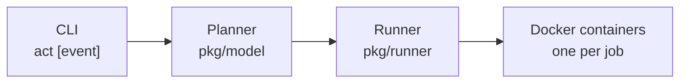

`act` is a command-line tool that runs your GitHub Actions workflows locally. Instead of committing every change to test a workflow, you run `act` from your terminal and get the same output you would see on GitHub — in seconds, not minutes.

## Why use act?

**Fast feedback loop.** Testing a workflow change normally requires a commit, a push, and waiting for a GitHub-hosted runner to pick up the job. With `act`, you iterate locally. The environment variables and filesystem structure match what GitHub provides, so what works locally works on GitHub.

**Local task runner.** Your `.github/workflows/` files define jobs that can build, test, lint, or deploy your project. `act` lets you run any of those jobs on demand from the command line, making it a capable replacement for a `Makefile`.

## How it works

When you run `act`, it reads your `.github/workflows/` directory and determines which jobs to run based on the event you specify (defaulting to `push`). It then uses the Docker API to pull or build the container images defined in your workflow files and runs each job in its own container. Environment variables, secrets, and the filesystem layout are configured to match GitHub's hosted runners.

### Architecture overview

| Layer | Package | Responsibility |
|---|---|---|
| CLI | `cmd/root.go` | Parses flags into an `Input` struct; resolves config from `.actrc` |
| Planner | `pkg/model/planner.go` | Parses workflow YAML into a `Plan` of serial `Stage`s containing parallel `Run`s |
| Runner | `pkg/runner/runner.go` | Converts the plan into composable `Executor` chains |
| Container | `pkg/container/` | Wraps the Docker API; manages image pulls, container lifecycle, and volume mounts |

The `Executor` type (`pkg/common/executor.go`) is a `func(ctx context.Context) error`. Executors compose with `.Then()`, `.Finally()`, and `NewParallelExecutor()`, so serial and parallel job execution are both first-class.

## Key capabilities

<CardGroup cols={2}>
  <Card title="Secrets and variables" icon="key">
    Pass secrets with `-s mysecret=value`, environment variables with `--env`, and workflow inputs with `--input`. Read them from files with `--secret-file`, `--env-file`, and `--var-file`.
  </Card>
  <Card title="Matrix builds" icon="grid-2">
    Filter matrix configurations with `--matrix java:17` to run only specific combinations of a matrix strategy.
  </Card>
  <Card title="Artifact support" icon="box-archive">
    A built-in artifact server emulates the GitHub artifact upload/download API, so `actions/upload-artifact` and `actions/download-artifact` work without modification.
  </Card>
  <Card title="Actions cache" icon="database">
    A built-in cache server emulates the GitHub Actions cache API, enabling `actions/cache` to work locally.
  </Card>
  <Card title="Watch mode" icon="eye">
    Run `act --watch` to re-execute workflows automatically whenever files in your repository change.
  </Card>
  <Card title="GitHub Enterprise support" icon="building">
    Point `act` at a GitHub Enterprise Server instance with `--github-instance` and map GHE actions to their github.com equivalents with `--replace-ghe-action-with-github-com`.
  </Card>
</CardGroup>

## Next step

<Card title="Installation" icon="download" href="/installation">
  Install act on macOS, Linux, or Windows
</Card>
